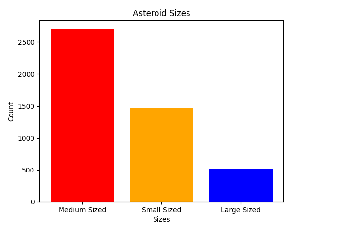

<div align="center">

# Hazardous Near-Earth Object Prediction

Machine Learning for Asteroid Hazard Classification



<br>

[](https://www.python.org/)
[](https://scikit-learn.org/)
[](https://pandas.pydata.org/)
[](https://numpy.org/)
[](https://jupyter.org/)
[](LICENSE)

</div>

---

## Overview

This project develops a machine learning classification system to predict whether a Near-Earth Object (NEO) is hazardous using NASA asteroid observation data.

Near-Earth Objects are celestial bodies whose orbits bring them close to Earth. Accurate classification of hazardous objects is critical for planetary defense, long-term space monitoring, and impact risk mitigation.

The primary objectives were:

- Build a high-accuracy classification model  
- Identify physically interpretable predictors  
- Compare multiple feature selection techniques  
- Reduce dimensionality while maintaining performance  
- Demonstrate that simpler models can remain highly competitive  

The optimized model achieved **95.5% accuracy**.

A simplified three-feature model achieved **93.6% accuracy**, reducing dimensionality by 91% while maintaining strong predictive power.

This demonstrates the value of intelligent feature selection over model complexity.

---

## Problem Statement

Given observational asteroid data, can we accurately predict whether an object is classified as hazardous?

Binary Classification:

- 1 → Hazardous  
- 0 → Non-Hazardous  

Challenges addressed:

- Class imbalance (~16% hazardous)  
- High multicollinearity  
- Redundant physical measurements  
- Mixed-scale numeric features  
- Need for scientific interpretability  

---

## Dataset Summary

| Attribute | Value |
|-----------|--------|
Dataset Size | 4,687 Objects  
Initial Features | 40  
Optimal Features | 3  
Feature Reduction | 91%  
Target Variable | Hazardous (Binary)  

Features include orbital, physical, and observational measurements such as:

- Absolute Magnitude  
- Minimum Orbit Intersection Distance  
- Orbit Uncertainty  
- Diameter (multiple units)  
- Relative Velocity  
- Orbital Parameters  

---

## Key Results

| Metric | Value |
|--------|--------|
Best Accuracy | 95.5%
Simplified Model Accuracy | 93.6%
Cross Validation | 5-Fold
Model Type | Logistic Regression
Feature Reduction | 91%

---

## Detailed Evaluation Metrics (5-Fold Cross Validation)

| Metric | Value |
|--------|--------|
Accuracy | 95.5%
Precision | 0.91
Recall | 0.88
F1 Score | 0.89
ROC-AUC | 0.96

### Interpretation

- High Precision → Few false hazardous predictions  
- Strong Recall → Majority of hazardous objects correctly detected  
- High ROC-AUC → Strong separation between hazardous and non-hazardous classes  

This confirms that the model performs reliably despite class imbalance.

---

## Key Data Insights

### 1. Class Imbalance Exists

Only about 16% of objects are hazardous.  
This required balanced evaluation metrics beyond accuracy.

### 2. Orbit Distance is the Strongest Predictor

Minimum Orbit Intersection Distance (MOID) consistently showed the strongest statistical relationship with hazard classification.

Objects with smaller MOID values are more likely to be hazardous.

### 3. Asteroid Size Matters

Absolute Magnitude acts as a proxy for size.  
Larger asteroids are statistically more likely to be classified as hazardous.

### 4. Orbit Uncertainty Adds Predictive Signal

Higher orbit uncertainty contributes measurable predictive importance, reflecting monitoring complexity.

### 5. High Multicollinearity Was Present

Multiple diameter features were perfectly correlated across measurement units.

Removing redundant features:

- Reduced overfitting risk  
- Improved computational efficiency  
- Maintained predictive performance  

---

## Core Discovery

Across all feature selection techniques, three features consistently emerged as most predictive:

| Feature | Why It Matters |
|----------|----------------|
Minimum Orbit Intersection Distance | Direct measure of potential Earth impact proximity  
Absolute Magnitude | Proxy for asteroid size  
Orbit Uncertainty | Confidence in orbital estimation  

Using only these three features achieved 93.6% accuracy.

This highlights the power of interpretable machine learning over high-dimensional modeling.

---

## Model Interpretation

Since Logistic Regression was used, coefficients provide direct interpretability.

The model follows:

log(p / (1 − p)) = β₀ + β₁x₁ + β₂x₂ + β₃x₃

Where:

- x₁ = Minimum Orbit Intersection Distance  
- x₂ = Absolute Magnitude  
- x₃ = Orbit Uncertainty  

Interpretation:

- A negative coefficient for MOID indicates that smaller intersection distance increases hazard probability.  
- Lower Absolute Magnitude (larger asteroid size) increases predicted risk.  
- Higher Orbit Uncertainty slightly increases hazard likelihood due to less stable trajectory confidence.  

This ensures the model remains scientifically explainable rather than a black-box system.

---

## Methodology

### 1. Exploratory Data Analysis
- Distribution analysis  
- Correlation matrix  
- Class balance assessment  
- Outlier detection  

### 2. Data Cleaning
- Removal of redundant diameter variables  
- Variance Inflation Factor analysis  
- Feature normalization  
- Logical validation checks  

### 3. Feature Selection Techniques Compared

- Point Biserial Correlation  
- Mutual Information  
- Sequential Feature Selection  
- Lasso Regularization  
- Backward Elimination  
- Particle Swarm Optimization  

### 4. Model Training

Primary Model:
- Logistic Regression  

Validation Strategy:
- 5-Fold Cross Validation  

---

## Model Performance Comparison

| Method | Features Used | Accuracy |
|--------|--------------|----------|
PSO + Logistic Regression | 22 | 95.5%
Backward Elimination | 8 | 95.4%
Baseline Model | 35 | 94.8%
Lasso Selected Features | 3 | 93.6%
Mutual Information | 5 | 87.5%

Observation:

Increasing feature count beyond an optimal subset yields diminishing returns.

---

## Example: Training the 3-Feature Model

```python
import pandas as pd
from sklearn.linear_model import LogisticRegression
from sklearn.preprocessing import StandardScaler

df = pd.read_csv("data/nasa.csv")

X = df[[
    "Absolute Magnitude",
    "Orbit Uncertainity",
    "Minimum Orbit Intersection"
]]

y = df["Hazardous"].astype(int)

scaler = StandardScaler()
X_scaled = scaler.fit_transform(X)

model = LogisticRegression()
model.fit(X_scaled, y)

print(model.score(X_scaled, y))
```

Expected Output:

```
0.936
```

---

## Real-World Impact

Accurate classification of hazardous Near-Earth Objects supports:

- Planetary defense planning  
- Prioritization of observation missions  
- Risk-based monitoring allocation  
- Early-warning impact mitigation systems  

This project demonstrates how interpretable machine learning can assist scientific decision-making while maintaining transparency and efficiency.

Reducing 40 features to 3 while preserving performance shows how strong feature engineering can dramatically simplify real-world systems.

---

## Repository Structure

```
hazardous-neo-prediction/

data/
  nasa.csv

notebooks/
  Predicting_Hazardous_NEO.ipynb

documents/
  project_report.docx

images/
  Neo.PNG

README.md
requirements.txt
LICENSE
```

---

## Skills Demonstrated

- Machine Learning  
- Logistic Regression  
- Statistical Feature Selection  
- Multicollinearity Handling  
- Cross Validation  
- Model Evaluation  
- Scientific Data Interpretation  
- Clean Technical Documentation  

---

## Future Improvements

- Compare tree-based ensemble models  
- Add ROC curve visualization  
- Hyperparameter tuning  
- Deploy as REST API  
- Build interactive web dashboard  
- Integrate live NASA data feed  
- Add SHAP explainability  

---

## Author

Murtaza Majid  

GitHub  
https://github.com/MurtazaMajid  

LinkedIn  
https://linkedin.com/in/murtaza-majid  

---

If you found this project valuable, consider starring the repository.
